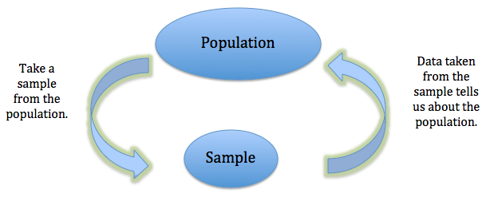

--- 
title: "A Minimal Book Example"
author: "Yihui Xie"
date: "`r Sys.Date()`"
site: bookdown::bookdown_site
output: bookdown::gitbook
documentclass: book
bibliography: [book.bib, packages.bib]
biblio-style: apalike
link-citations: yes
github-repo: rstudio/bookdown-demo
description: "This is a minimal example of using the bookdown package to write a book. The output format for this example is bookdown::gitbook."
---

# Introduction

Placeholder


<!--chapter:end:index.Rmd-->

---
output:
  pdf_document: default
  html_document: default
---
# Unit 1 : Examining Distributions

## Introduction: What is statistics?

Statistics is, in many ways, the science of data. Though popular belief is that it is all about calculating numbers and math, this is not true. It is a wide encompassing discipline that starts before data is even collected and continues on after the numbers have been ``crunched''. 

Broadly speaking, statistics is a branch of science which deals with collecting, organizing, analyzing, interpreting, summarizing, and presenting data. A key catch phrase of this introductory course is ``Garbage in, garbage out''. Data means nothing if it is not collected properly or it is not representative of what it is actually measuring. 

The statistician's job begins once a question has been identified and they need to decide what data could be collected to answer that question. Then they need to physically collect that data in a way that will accurately and responsibly reflect what is really happening. Particularly with large amounts of data, the statistician then needs to find a way to organize the data and store it so that it available in an easily readable format that can be accessed by computers and technology. Then comes the math and analysis where statisticians must pick appropriate techniques. But the numbers themselves are not meaningful until they are interpreted by the statistician so that we know what they say about the problem. While there could be a lot of data, a lot of output, and a lot of statistical talk, at the end of the day, it is someone other than the statistician that needs to use the data so the relevant parts needs to be picked out. Finally, a report must be written and given to the company/government/people who asked the question and they must be able to take practical conclusions away from the numbers and they will rely on the statistician to present it properly.

The most important thing to take away is that, at the end of the day, data is collected so that someone can use it. Presenting the head of a company with thousands of points of data is not helpful nor is presenting a report laden in statistical jargon. The valuable skill you will hopefully take away from this course is being able to interpret and explain numbers in practical terms that a non-statistician can understand. Keeping this in mind, there are two viewpoints I would always like you to keep in mind as you go through this course.

Firstly, I would like you to consider the content through the eyes of a statistician. As a statistician, it is your responsibility to ensure you are always reporting your data with clarity, precision, and honesty. You have to tell people where your data came from, how it was collected, make sure all of your graphs are to scale, that they are labeled, that they are sourced correctly and it is lined out in plain English what your data is trying to convey. At the end of the day, someone has to use your data and it is imperative that they can trust your reposting and that they can easily understand your findings to make informed decisions.

Secondly, I would like you to consider the content through the eyes of a non-statistician who has to use their best judgement on a daily basis to make important life decisions. While I am sure the vast majority of people who take introductory statistics will never have to make an outlier boxplot, interpret a regression line or conduct a hypothesis test after completing their course, there is a much more vital skill the course teaches that you will use nearly every single day of your life. This is the ability to reason whether or not a number sounds feasible, question the integrity of the source, judge if you are being given full disclosure, and decide if the number is reliable. In your life, you will constantly be asked to make decisions based on the best information available to you. People will constantly present you with facts and statistics on the radio, in news reports, in health reports, on social media, etc... This course will teach you how to interpret those numbers and help you ask the right questions and develop the right tools to make sure you're basing those decisions on solid information.

## Basic Terminology

To begin this course we need to start out by establishing some terminology so that we can properly communicate our ideas to each other.

<div class="definition">
```{definition, name="Individual"}
An object on which we take a measurement or observation.
```
</div>

For example, if we are measuring a person's heart rate, our unit would be the person. If we are looking for nutrient content in a soil sample, our unit would be the soil. If we are finding the average property value for different cities, our unit would be the city. So units could be people, places, things, etc...

An important distinction that needs to be made for this course is the difference between samples and populations.

<div class="definition">
```{definition, name = "Population"}
The collection of all individuals or units under consideration.
```
</div>

<p>

<div class="definition">
```{definition, name = "Sample"}
A subset of the population from which we obtain data.
```
</div>

So from the <span style="color:blue">population</span> of <span style="color:blue">all STAT 1000 students</span> we take a <span style="color:red">sample} of <span style="color:red">ten students from each class</span> to see how many other courses they are taking.

From the <span style="color:blue">population</span> of <span style="color:blue">all eligible voters in the City of Winnipeg</span> we take a <span style="color:red">sample</span> of <span style="color:red">300 voters</span> to estimate how many people are planning to vote for Sam Katz.

From the <span style="color:blue">population</span> of <span style="color:blue">all elm tress in Winnipeg</span> we take a <span style="color:red">sample</span> of <span style="color:red">200 trees</span> to test for dutch elm disease.

The difference between a population and a statistic is right at the heart of what statistics is all about. We seek to answer questions about populations but usually it is impractical to survey every member of a population because they can be very large. Instead we take samples and collect data from them. The hope is that if we pick a random sample that is \textbf{representative} of the population, then any information we collect on the sample will accurately carry over to the entire population.




When describing our units and taking measurements we are assessing variables.

```{definition, name = Variable}
Any characteristic or property of an individual.
```

But what we might notice, is that this definition is very broad. There are lots of different types of variables and data. In the voting example, our variable of <span style="color:blue">whether and voter would vote for Sam Katz</span> had a yes/no response but in the STAT 1000 example, our variable of <span style="color:blue">how many courses a student took</span> had a numeric response. This is a clear indication that there are many different types of data a person might collect. We will categorize our data in to three main groups:

\definition{quantitativedata}{Quantitative Data}{Takes numerical characteristics of an individual for which arithmetic operations make sense.}

Some examples of quantitative data are:
\begin{enumerate}
\item Birth weight
\item Final exam score
\item Blood sugar level
\item Gas mileage
\end{enumerate}

\definition{categoricalordinaldata}{Categorical (Qualitative) and Ordinal Data}{Puts individuals into groups based on common characteristics for which numerical operations do not make sense but for which there is a logical ordering.}

Some examples of categorical and ordinal data are:
\begin{enumerate}
\item T-shirt size (small, medium, large)
\item Satisfaction level (dissatisfied, neutral, satisfied)
\item Grade (Kindergarden, 1, 2, ...)
\item TV station (1,2,3,...)
\end{enumerate}

\tip{When deciding if something has an order, think of the ``person on the street'' test. If you were to give all the levels to random people on the street, would they all be able to order them identically without a problem? If you need to come up with a tricky argument for why they should be ordered, it is not categorical and ordinal.}

\definition{categoricalnominaldata}{Categorical and Nominal Data}{Puts individuals into groups based on common characteristics for which numerical operations do not make sense and there is no logical ordering.}

Some examples of categorical and nominal data are:
\begin{enumerate}
\item Car manufacturer (Kia, Ford, Chevy, ...)
\item Telephone number
\item Cell phone brand (Apple, Samsung,...)
\item Political Party Affiliation (NDP, PC, Liberal, Green, ...)
\end{enumerate}

\tip{Just because something is a number, does not make it numeric nor ordinal. Area codes are numbers but numeric operations do not make sense (you cannot meaningful discuss an ``average area code'') and you cannot order them (there is no concept of a ``bigger'' area code and they aren't assigned in any sort of ascending order). Think of categorical and nominal as the ``dustbin'' type. If it is not anything else, it is categorical and nominal.}

\begin{center}
\includegraphics[scale=.8]{variabletype.png}
\end{center}

Variables can be further described by their distribution:

\definition{distribution}{Distribution}{The distribution of a variable tells us what values a variable takes on and how often it takes on those values.}

\tip{Remember that variables are not necessarily numeric. Value could mean ``blue'' or ``defective''.}

<!--chapter:end:01-describing-data.Rmd-->

